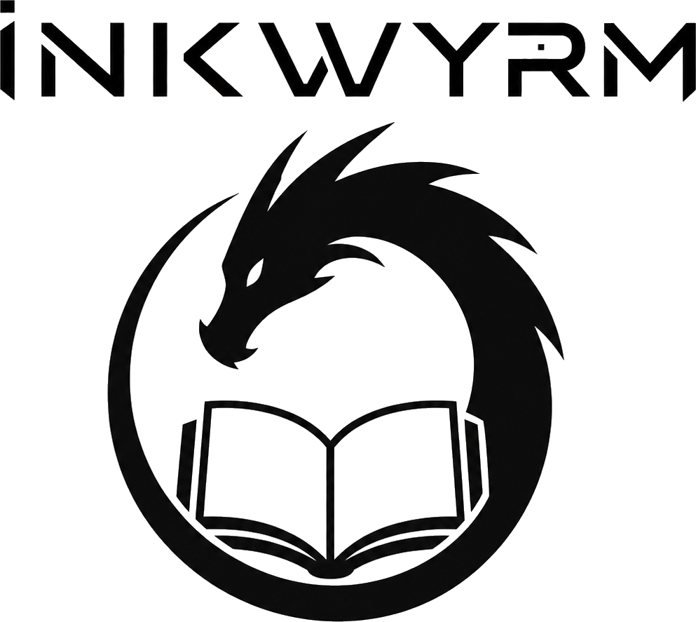

<p align="center">
  <picture>
    <source media="(prefers-color-scheme: dark)" srcset="docs/assets/inkwyrm-logo-dark.png">
    
  </picture>
</p>

<p align="center"><b>Custom firmware for the XTeink X4 pocket e-reader (ESP32-C3).</b></p>

<p align="center">
  
  
  
</p>

## Why this exists

The XTeink X4 is a tiny e-ink reader that snaps to the back of my phone with
MagSafe. That one detail changed how much I read. It cut my screen time and let
me read whenever and wherever, with almost no friction to get started.

When I found out there is a developer edition that runs custom firmware, I knew
I would want to tinker and build one that fit exactly how I read. The name is
the gist of it: E-ink display, bookworm, wyrm like the dragon.

InkWyrm is a fork of CrossPoint (the `cpr-vcodex` line), rebased onto CrossPoint
1.4.1 to pick up its newer memory and rendering work, with my own features on
top. A lot of it ties into my self-hosted setup and will work for anyone running
something similar. It is the reader I wanted: quick, able to sync reading
position through KOSync, and out of the way.

## What it does

* **Reading position sync.** Open a book on one KOSync-connected device and pick
  it up on another where you left off. It uses the standard KOSync protocol and
  can point at your own server. It pulls on open and pushes on close.
* **Compact info bar.** One line while you read: clock, chapter, time left, and a
  thin progress bar with chapter ticks.
* **Highlighting and annotation.** Start a selection anywhere on the page. Notes
  are stored per book in a plain, sync-friendly format.
* **Typography controls.** Small caps, drop caps, CSS line height, and smarter
  line breaking. These are computed when a book is cached so page turns stay
  quick.
* **Dark mode.** Double-tap the power button to switch a text page to white on
  black for night reading.
* **Setup from the SD card.** Put an `inkwyrm.conf` file on the SD card with your
  WiFi and sync details. The device reads it on boot, so there is no on-screen
  keyboard setup.
* **Reading stats and random book picking.**
* **Sleep screen options.** Show the last cover or shuffle your own wallpapers.
* **Last-sync status.** A home-screen line shows how recent your last sync was.

It runs within the limits of the hardware: roughly 380 KB of RAM, no PSRAM, and
a 4-level grayscale panel. Every feature has to fit inside that ceiling.

## Standalone or self-hosted

InkWyrm works fine on its own. Without anything else configured, it is CrossPoint 1.4.1 with a compact info bar, double-tap dark mode, more reliable WiFi joining, SD-card configuration, and some branding and typography polish.

I made it for the self-hosted side, though. Point it at services you run and it can sync your reading position, browse your OPDS library, and send reading stats where you want them.

## The self-hosted angle

A lot of what makes this fun is that it plugs into infrastructure I already run
at home, and none of it depends on anyone's cloud.

* **Reading position on my own rails.** The reader speaks the standard KOSync
  protocol and points at a sync server on my own domain. My phone, my other
  e-reader, and the X4 all agree on where I am in a book, reachable from any
  network with WiFi. No account with a store, no lock-in.
* **Books from my own library.** The X4 pulls titles over OPDS from a library
  I host, so the same catalog and organization show up on every device.
* **Reading stats I keep.** Time, pages, and streaks feed a dashboard I run,
  in a format that plays nicely with the wider KOReader ecosystem.
* **Config on a card, not in a form.** Point it at your WiFi and your sync
  server by editing a small text file (`inkwyrm.conf`). It applies on boot,
  then wipes the secrets from the card unless you tell it not to.

If you run a similar setup, this drops straight in. If you do not, everything
still works against any KOSync-compatible server.

## Bring your own infrastructure

None of this is required. You can just read.

* **Reading-position sync:** a KOReader-KOSync-protocol server. This keeps your place in a book in sync across your devices.
  * [koreader-sync-server](https://github.com/koreader/koreader-sync-server), the official option.
  * [kosync-dotnet](https://github.com/jberlyn/kosync-dotnet), if you want to disable open registration.
* **Your library over OPDS:** a Calibre-based OPDS catalog. This lets the reader browse and download books from your own library.
  * [Calibre-Web-Automated](https://github.com/crocodilestick/Calibre-Web-Automated)
  * [Calibre-Web](https://github.com/janeczku/calibre-web)
* **Reading stats dashboard:** [KoInsight](https://github.com/GeorgeSG/KoInsight). It gives you a KOReader-stats-compatible view of your reading.
* **Other devices in the sync fleet:** [KOReader](https://github.com/koreader/koreader). It can keep the X4 in sync with your other readers.

Configuration lives in `inkwyrm.conf` on the SD card. See `inkwyrm.conf.example`.

## How it is built

* **A fork, not a rewrite.** It sits on CrossPoint / `cpr-vcodex`, and I rebased
  the whole thing onto CrossPoint 1.4.1 so it inherits the newer memory and
  rendering work instead of fighting an older base. Features get re-applied on
  top, one at a time, each one additive.
* **Memory is the ceiling.** ESP32-C3, no PSRAM, a single framebuffer. Features
  use fixed buffers and cache-time work so the reading path stays quick and
  nothing grows the heap per page.
* **Flash and verify.** I use [`tools/flash-and-verify.sh`](tools/flash-and-verify.sh)
  to check a release-provided SHA-256, identify the target device, check its app
  partition, create a full local backup, and verify the written image. It is shared
  as my macOS dev tooling for inspection and use at your own risk. See
  [`docs/flashing.md`](docs/flashing.md).
* **Reviewed before it ships.** Nothing lands until it survives on the hardware
  in my hand. Versioned, changelogged, and kept in sync with upstream.

## Status

This is a personal project that I use every day. It works well for me on my
hardware. It is shared as is, with no warranty. If you flash it, keep a backup
of your stock firmware first.

## Building

Built with PlatformIO. Pull the SDK submodule, then build:

```text
git submodule update --init --recursive
pio run
```

See `docs/` for flashing, the SD card config format (`inkwyrm.conf.example`), and
the reader features.

## Credits and license

Built on CrossPoint / `cpr-vcodex`, which is MIT licensed, and it stays MIT here.
See `LICENSE`. Thanks to everyone who worked on CrossPoint and the open X4 SDK.
The bundled reading fonts keep their own OFL licenses.
